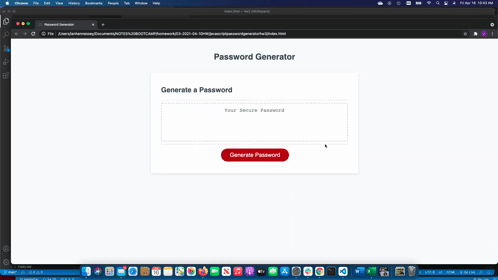

# javascriptpasswordgeneratorhw3
## Javascript Password Generator HW 3 MSU Bootcamp

## Michigan State University Coding Bootcamp 

Project By: Ian Hennessey 
GitHub Profile:  <https://github.com/atleastitsanethosman> 
Project GitHub Repository: <https://github.com/atleastitsanethosman/javascriptpasswordgeneratorhw3> 
Project URL: <https://atleastitsanethosman.github.io/javascriptpasswordgeneratorhw3/> 

## Project Description
The purpose of this project was to use javascript to create a password generator that allows a user to request a password between 8 and 128 characters in length, and gives the user options to allow uppercase letters, lowercase letters, special characters, and numbers in the password.  Based on the allowed categories there is a function built in to generate a random string and populate it in the password window.  A GIF of the application function is displayed below.

## GIF of Deployed Application

## Project Elements: 

1. The webpage has a button to press to generate a password.

2. There is a prompt that comes up asking for a length between 8 and 128 characters, user will be alerted if not entering an acceptable value and function will end.

3. There are a series of confirmation boxes that pop up asking the user about what will be allowed in the population of characters that will be randomly selected to make the password.  There are prompts for uppercase letters, lowercase letters, special characters, and numbers.

4. If no characters are allowed an error message is returned indicating that at least one type must be selected and ends the function.

5. If satisfactory inputs as noted above are given, the newly generated password displays in the webpage in a box for the user to see.
